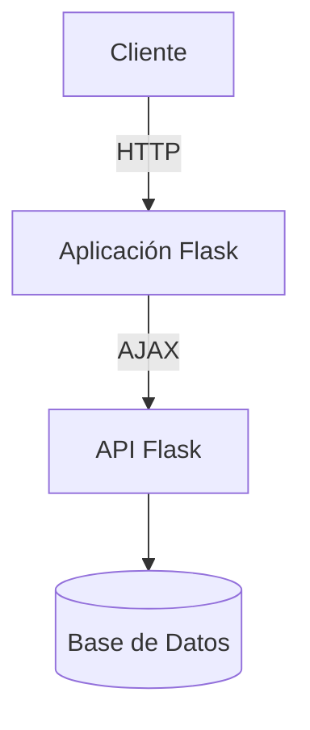
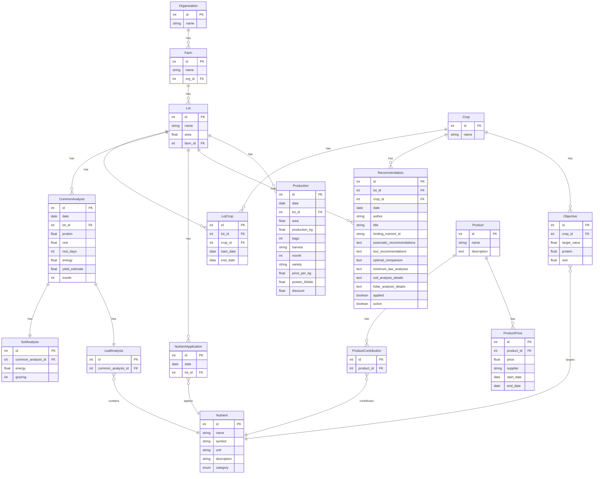

# TecnoAgro

Sistema de Gestión de Nutrición Foliar en Cultivos

# Instrucciones para Agentes de IA

Punto de entrada obligatorio: `project/run.py` → `app/__init__.py` `create_app()` factory.

## Documentación de Referencia para Agentes

Antes de realizar cambios en el código, consulta estos documentos:

0. **`.ai-context/MANIFEST.md`** - Sistema de navegación cognitiva comprimida

Intenta definir si con este contexto es suficiente para realizar la tarea, lee otros documentos solo si es necesario. 

1. **`DEVELOPMENT_GUIDE.md`** - Guía completa de desarrollo con arquitectura, convenciones y reglas críticas.
   - Sección 1: Application Layer (punto de entrada, configuración Flask, variables de entorno)
   - Sección 2: Architecture (descripción arquitectónica, separación de responsabilidades, patrones)
   - Sección 3: Code Quality (convenciones de nombrado, estilo de código, deuda técnica)
   - Sección 4: Controllers & Frontend (organización de rutas, endpoints, integración frontend)
   - Sección 5: Critical Rules (restricciones NO negociables, dependencias críticas)
   - Sección 6: Infrastructure (dependencias externas, configuración de entorno)
   - Sección 7: Logging & Events (implementación actual de logs, brechas)
   - Sección 8: Workflows (flujos de negocio principales, secuencias de llamadas)
   - Sección 9: Development Guidelines (cómo agregar endpoints/modelos, mejoras priorizadas)

2. **`TECNOAGRO_ANALYSIS.md`** - Análisis técnico detallado del código legacy.
   - Incluye evaluación de deuda técnica, áreas de riesgo, y dependencias frágiles.
   - Proporciona ejemplos concretos de patrones existentes en el código.

3. **`EXPLORATION.md`** - Exploración completa del código base por el agente especializado.
   - Mapeo de módulos, archivos clave, y relaciones estructurales.

## Arquitectura Clave para Agentes

- **Tipo**: Monolito modular Flask con separación core/módulos.
- **Patrones**: MVC, Factory, Repository/Service (parcial), RBAC completo.
- **Autenticación**: JWT en cookies HTTP‑only con protección CSRF.
- **Base de datos**: SQLAlchemy + Alembic migrations (soporta SQLite/MySQL/MariaDB/PostgreSQL).
- **Módulos activos**: `foliage`, `agrovista`, `media`, `foliage_report` (configurados en `app/config.py`).
- **Rutas**: Blueprints web (`/dashboard/{module}`) y API (`/api/{module}`).
- **Frontend**: Jinja2 templates con Tailwind CSS, server‑rendered.

## Reglas Críticas (NO Violar)

1. **Cambios de esquema de BD** → usar migraciones Alembic (nunca `db.create_all()` en producción).
2. **Consultas a modelos** → siempre filtrar por `org_id` para prevenir fugas de datos entre organizaciones.
3. **Permisos** → usar decorators `@jwt_required()` y `@check_permission()` en todos los endpoints.
4. **Tareas largas** (>1s) → ejecutar en background (ThreadPoolExecutor actual).
5. **Configuración JWT** → mantener `JWT_COOKIE_SECURE=True` y `JWT_COOKIE_CSRF_PROTECT=True` en producción.

## Cómo Agregar un Nuevo Endpoint (Patrón Actual)

1. Determinar tipo: web (HTML) o API (JSON).
2. Añadir ruta en `<module>/web_routes.py` o `<module>/api_routes.py`.
3. Implementar `MethodView` class en `<module>/controller.py` con decorators apropiados.
4. Validar entrada con Marshmallow schemas o `APIValidator`.
5. Retornar respuesta JSON estandarizada (API) o renderizar template (web).

Ejemplo API (de `foliage/api_routes.py`):
```python
farm_view = FarmView.as_view("farms_view")
api.add_url_rule("/farms/", view_func=farm_view, methods=["GET", "POST", "DELETE"])
api.add_url_rule("/farms/<int:id>", view_func=farm_view, methods=["GET", "PUT", "DELETE"])
```

## Puntos de Atención para Agentes

- **Archivos grandes**: `core/controller.py` (1458+ líneas), `foliage/models.py` (3268+ líneas) – evita aumentar su tamaño.
- **Testing**: cobertura mínima – añadir tests para cambios críticos.
- **Logging**: solo errores no manejados – considerar logging estructurado para nuevas funcionalidades.
- **Background tasks**: sin persistencia/monitoreo – diseñar nuevas tareas como idempotentes.

## Mejores Prácticas para Modificaciones

- **Seguir convenciones existentes**: nombrado `snake_case` funciones, `PascalCase` clases.
- **Mantener separación web/API**: blueprints distintos para cada tipo.
- **Validar permisos**: usar `check_resource_access()` para recursos organizacionales.
- **Documentar cambios**: añadir docstrings en formato consistente (Google style preferido).
- **Probar con datos realistas**: simular múltiples organizaciones para evitar regresiones en RBAC.


## 1. Introducción

<pre>En este documento se describe la estructura y las relaciones de la base de datos 
diseñada para un proyecto base de Flask con modularidad y control de 
acceso. La base de datos está diseñada para soportar la gestión de usuarios proporcionando
una base sólida para el desarrollo de funcionales adicionales escalables y seguras.

Este modelo SQLAlchemy implementa un sistema de control de acceso basado en roles y permisos, diseñado para gestionar usuarios, sus roles, permisos y acciones asociadas dentro de un esquema de reseller. Incluye también modelos para clientes, límites para reseller y módulos del sistema.

Gestión de permisos:

El modelo de roles, acciones y permisos es manejado de manera estática con enumeraciones
La definición de roles, acciones y permisos se hace mediante enums para que la estructura sea muy clara y fácil de mantener.

Los cambios en los permisos o roles se pueden gestionar de manera centralizada en los enums y diccionarios asociados.
</pre>

### **Descripción del Software: TecnoAgro**  

El proyecto TecnoAgro consiste en un sistema de software para la gestión de datos relacionados con la nutrición foliar en cultivos diseñado para ayudar a los agricultores a optimizar el uso de nutrientes y mejorar la producción. Cómo insumo se ingresan los datos obtenidos a partir de imágenes de drones procesadas externamente y complementadas con información ingresada manualmente. 

El sistema recibe estos datos a través de una API y un formulario de ingreso, los analiza y los almacena para generar recomendaciones personalizadas basadas en parámetros locales de nutrientes. Su enfoque permite una toma de decisiones precisa, mejorando la eficiencia en el uso de recursos y la productividad agrícola.

Entre las tecnologías seleccionadas están MariaDB/MySQL, Flask, Flask-SQLAlchemy, Jinja2 templates, blueprint y Flask-JWT-Extended para login y API.

## 2. Instalación

1. Copia `.env.example` a `.env` en la raíz del proyecto y edita los valores según tu entorno.
2. Dentro de `project/` ejecuta:

```bash
make install      # dependencias de producción
# o
make installdev   # dependencias de desarrollo y Tailwind
```

3. Inicia la aplicación con `make run`.
4. La documentación generada estará disponible en [`docs/index.html`](docs/index.html).

### Comandos Makefile

- `make install` / `make installdev` – crean el entorno virtual e instalan dependencias.
- `make run` – ejecuta la aplicación en segundo plano.
- `make test` – ejecuta las pruebas con pytest.
- `make documents` – genera documentación en `docs/` usando pdoc.
- `make css` – compila los estilos Tailwind.
- `make stop` – detiene el servidor.
- `make clean` – elimina el entorno virtual y archivos temporales.

### Docker

El proyecto incluye `docker-compose.yml` para un despliegue rápido:

```bash
docker-compose up -d
```

El script `make_nginx.conf.sh <dominio>` ayuda a generar la configuración de Nginx y certificados con certbot.

### CLI para crear módulos

El script `cli/create_module.py` genera la estructura inicial de un módulo Flask. Puedes crear un módulo básico ejecutando:

```bash
python cli/create_module.py <nombre> --api --ui
```

Esto crea la estructura en `project/app/modules/` y deberás añadir el nombre del módulo en `app/config.py`.

## Documentación

La documentación se genera con `make documents` y queda disponible en [`docs/`](docs/).

## 3. Arquitectura del Software

La arquitectura del sistema se basa en un diseño modular y escalable, utilizando el patrón MVC (Modelo-Vista-Controlador) con una arquitectura RESTful para separar la lógica de negocio, la presentación y el acceso a datos. 

### Modelo (Model)
Base de datos : Se utiliza **Flask-SQLAlchemy** para interactuar con la base de datos MySQL. Las tablas y relaciones se definen como clases Python, siguiendo el patrón de Active Record.

**Migraciones** : Flask-Migrate se usa para gestionar cambios en el esquema de la base de datos (creación, actualización, etc.).

### Vista (View)

**Templating**
- **Jinja2** se utiliza para generar HTML dinámico. Las plantillas están organizadas de forma modular, reutilizando componentes comunes como headers y footers para mantener la consistencia y facilitar el mantenimiento.

**Frontend**
- **Tailwind CSS** se integra para estilizar la interfaz, proporcionando un diseño responsivo y moderno.
- **JavaScript** interactúa con los endpoints de la API, permitiendo una experiencia de usuario dinámica y fluida.

###  Controlador (Controller)

- **Rutas:** Se definen en archivos separados utilizando **Blueprints** de Flask. Esto modulariza la aplicación, promoviendo un código limpio y organizado.
- **Lógica de negocio:** Se maneja en funciones independientes, asegurando la separación de responsabilidades siguiendo los principios SOLID.

**Seguridad** y **Validaciones**
   - **Werkzeug**: Implementación segura de hash de contraseñas.
   - **Marshmallow**: Librería para serialización y validación de datos, garantizando la integridad de los datos antes de su almacenamiento.

### Manejo de APIs
- **Endpoints:** Se implementan como rutas específicas en Flask, devolviendo respuestas en formato JSON para ser consumidas por clientes como el frontend web o aplicaciones móviles.
- **Autenticación:** Se utiliza **flask-jwt-extended** para gestionar la autenticación basada en tokens, garantizando un acceso seguro a los recursos protegidos. Se Implementa JWT (JSON Web Tokens) para autenticación de usuarios. Gestiona tokens de acceso y actualización, con funcionalidades como:
     - Login
     - Logout
     - Refresh token
     - Protección de rutas con `@jwt_required()`


La estructura del proyecto sigue patrones de diseño modernos, con módulos separados para:
- Modelos de datos (`model.py`)
- Rutas y vistas (`routes.py`)
- Endpoints  (`api_routes.py`)
- Funcionalidades auxiliares (`controller.py`)

El código incluye manejadores de errores, logging y excepciones, asegurando una buena practica para la depuración y monitoreo.
Se utiliza el Micro framework **Flask**  para desarrollar aplicación web en Python y Blueprints para modularizar la aplicación.



### Resumen de Componentes Clave
**Templating**: Jinja2 organiza plantillas de forma modular.
**Frontend**: Utiliza Tailwind CSS para estilos y JavaScript para interacciones dinámicas con la API.
**Controladores**: Gestionados mediante Blueprints para modularizar rutas.
**Lógica de Negocio**: Separada en funciones independientes siguiendo principios SOLID.
**Manejo de APIs**: Endpoints REST seguros con autenticación basada en tokens mediante flask-jwt-extended.

## 4. Requisitos de la herramienta

#### Requisitos Funcionales

1. Gestión de usuarios y autenticación
	- Creación de usuario admin.
	- Inicio de sesión
	- Registro de usuarios y asociación a fincas
	- Gestión de permisos por usuario y finca
2. Ingreso de datos
	- Formulario para ingreso manual de datos
		- ***A futuro***: Integración con API externa para recepción de datos procesados de imágenes de drones
		- Importación y exportación de datos a CSV
3. Análisis y almacenamiento de datos
	- Procesamiento de datos recibidos
	- Almacenamiento en la base de datos
4. Generación de recomendaciones
	- Análisis de datos almacenados
	- Generación de recomendaciones personalizadas basadas en parámetros locales de nutrientes
5. Reportes y visualizaciones
	- Generación de reportes de estado
	- Creación de gráficas de seguimiento
	- Generación de pronósticos
	- Análisis de antagonismo entre nutrientes
6. Gestión de fincas y lotes
	- Creación y edición de fincas
	- Gestión de lotes por finca
7. Gestión de productos y precios
	- Mantenimiento de catálogo de productos
	- Actualización de precios

#### Requisitos No Funcionales

1. Seguridad
	1. Implementación de autenticación JWT
	2. Encriptación de datos sensibles
	3. Protección contra ataques comunes (SQL injection, XSS, CSRF)
2. Rendimiento
	1. Tiempo de respuesta menor a 2 segundos para operaciones comunes
	2. Capacidad para manejar al menos 1000 usuarios concurrentes
3. Escalabilidad
	1. Diseño modular que permita la fácil adición de nuevas funcionalidades
	2. Capacidad de escalar horizontalmente
4. Usabilidad
	1. Interfaz de usuario intuitiva y responsiva
	2. Compatibilidad con navegadores modernos
5. Mantenibilidad
	1. Código bien documentado y siguiendo estándares de codificación
	2. Uso de patrones de diseño para facilitar futuras modificaciones
6. Disponibilidad
	1. Tiempo de actividad del sistema de al menos 99.9%
7. Interoperabilidad
	1. ***A futuro:*** Integración fluida con la API externa de procesamiento de imágenes
	2. Capacidad para exportar datos en formatos estándar (CSV, JSON)

## 5. Diseño de la Base de Datos

El diseño de la base de datos se ha normalizado y optimizado para asegurar la eficiencia en la gestión de datos y evitar redundancias. Se han agregado tablas adicionales para manejar las relaciones entre usuarios, fincas y lotes.


### 1. **Modelo de permisos**

Se utiliza un diseño de "Permissions Based Access Control" (PBAC), que es muy flexible y escalable. 

---------------------

### Resumen del Modelo de Datos
1. **User**: Representa los usuarios del sistema.
2. **Role**: Los roles asignados a los usuarios.
3. **Permission**: Los permisos asociados a los roles.
4. **Action**: Las acciones que los permisos pueden realizar.
5. **Client**: Organizaciones que los usuarios pueden manejar.
6. **Module**: Módulos del sistema que los usuarios pueden acceder.
7. **ModulePermission**: Relación entre módulos y permisos.

### Diagrama de la Base de Datos de usuarios

